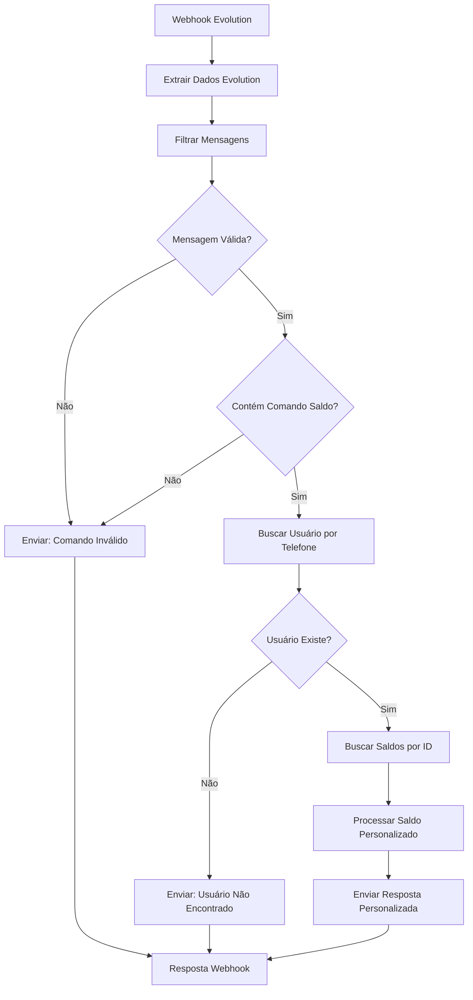

# Klube Cash - Workflow Inteligente com Evolution API

## 📋 Descrição

Workflow N8N inteligente para consulta de saldo usando **Evolution API** ao invés do WAHA. Mantém toda a lógica de identificação por ID no banco e mensagens personalizadas, apenas trocando a API de WhatsApp.

## 🔄 Mudanças da Versão WAHA

### ✅ **Substituído WAHA por Evolution API**
- **URL**: `https://evolutionapi.klubecash.com`
- **Instância**: `KluebCash`
- **API Key**: `HONejkqQLlxZoeYiaQxmUczVRTdqscw2`

### ✅ **Mantido Todo o Resto**
- ✅ Identificação por ID no banco de dados
- ✅ Mensagens completamente personalizadas
- ✅ Lógica inteligente de processamento
- ✅ Tratamento de todos os cenários

## 🚀 Como Importar

1. Acesse: `https://n8n.klubecash.com`
2. Login: `kaua@ticketsync.com.br` / `Sneha: Aaku_2004@`
3. Import: `n8n-workflow-klube-saldo-evolution-corrigido.json`

## ⚙️ Configuração

### 1. Webhook URL
```
https://n8n.klubecash.com/webhook/saldo-evolution
```

### 2. Evolution API (automaticamente configurada)
- **Base URL**: `https://evolutionapi.klubecash.com`
- **Instance**: `KluebCash`
- **API Key**: `HONejkqQLlxZoeYiaQxmUczVRTdqscw2`
- **Endpoint**: `/message/sendText/KluebCash`

### 3. Configurar Webhook na Evolution API
```bash
curl -X POST https://evolutionapi.klubecash.com/webhook/set/KluebCash \
  -H "Content-Type: application/json" \
  -H "apikey: HONejkqQLlxZoeYiaQxmUczVRTdqscw2" \
  -d '{
    "url": "https://n8n.klubecash.com/webhook/saldo-evolution",
    "enabled": true,
    "webhookByEvents": false,
    "webhookBase64": false,
    "events": [
      "MESSAGES_UPSERT"
    ]
  }'
```

### 4. Banco de Dados (mesmo do original)
- **Credenciais MySQL**: `63tY4U5gYm6JbGcd`
- **Tabela usuários**: Busca por telefone
- **Tabela cashback_saldos**: Busca por user_id

## 📊 Estrutura do Webhook Evolution API

O workflow processa webhooks da Evolution API com esta estrutura:

```json
{
  "data": {
    "key": {
      "remoteJid": "5511987654321@s.whatsapp.net",
      "fromMe": false
    },
    "message": {
      "conversation": "saldo"
    },
    "messageType": "conversation"
  }
}
```

## 🔧 Diferenças nos Nodes

### **Node: Extrair Dados Evolution**
```javascript
// Adaptado para webhook Evolution API
phoneNumber: $json.data.key.remoteJid.replace('@s.whatsapp.net', '').replace('@c.us', '')
message: $json.data.message.conversation || $json.data.message.extendedTextMessage?.text || ''
fromMe: $json.data.key.fromMe
messageType: $json.data.messageType
```

### **Node: Filtrar Mensagens**
```javascript
// Filtro adaptado para Evolution
messageType === "conversation" && fromMe === false
```

### **Nodes de Envio (3 nodes)**
```javascript
// HTTP Request para Evolution API
URL: https://evolutionapi.klubecash.com/message/sendText/KluebCash
Headers:
  - Content-Type: application/json
  - apikey: HONejkqQLlxZoeYiaQxmUczVRTdqscw2
Body: {
  "number": "{{ phoneNumber }}",
  "text": "{{ mensagem }}"
}
```

## 💬 Mensagens Personalizadas (Iguais ao WAHA)

### 👤 **Usuário com Saldo**
```
👋 Olá, João Silva!

💰 Seu Saldo Total: R$ 125,50

📊 Detalhamento:
Cashback Compras: R$ 85,30
Cashback Indicação: R$ 40,20

📅 Última atualização: 23/09/2025

🏪 Continue comprando nos estabelecimentos parceiros para acumular mais cashback!

💡 Dica: Você já pode solicitar o resgate do seu cashback!
```

### 👤 **Usuário sem Saldo**
```
👋 Olá, Maria Santos!

💰 Seu Saldo Atual: R$ 0,00

Você ainda não possui movimentações em sua conta.

🛍️ Faça suas compras nos estabelecimentos parceiros e comece a acumular cashback!
```

### ❌ **Usuário Não Cadastrado**
```
❌ Usuário não encontrado

Olá! Seu número 11987654321 não está cadastrado no sistema Klube Cash.

📞 Entre em contato conosco para fazer seu cadastro e começar a acumular cashback!
```

### 🚫 **Comando Inválido**
```
🚫 Comando não reconhecido

Para consultar seu saldo, envie uma das palavras:
• saldo
• extrato
• consulta
• quanto tenho

Ou digite 1 para o menu principal.
```

## 🔄 Fluxo do Workflow (Idêntico)



## 🎯 Comandos Reconhecidos (Iguais)

- ✅ `saldo`
- ✅ `extrato`
- ✅ `consulta`
- ✅ `quanto tenho`
- ✅ `1` (opção menu)

## 🛠️ Nodes do Workflow

1. **Webhook** - Recebe webhooks da Evolution API
2. **Extrair Dados Evolution** - Processa formato Evolution API
3. **Filtrar Mensagens** - Filtra mensagens válidas
4. **Verificar Comando Saldo** - Detecta comandos de consulta
5. **Buscar Usuário por Telefone** - MySQL: tabela usuarios
6. **Verificar se Usuário Existe** - Valida resultado
7. **Buscar Saldos por ID** - MySQL: tabela cashback_saldos
8. **Processar Saldo Personalizado** - JavaScript: mensagem personalizada
9. **Enviar Resposta Personalizada** - Evolution API: sendText
10. **Enviar: Usuário Não Encontrado** - Evolution API: sendText
11. **Enviar: Comando Inválido** - Evolution API: sendText
12. **Resposta Webhook** - Confirma processamento

## 🔧 Configurações Evolution API

### Headers Padrão
```json
{
  "Content-Type": "application/json",
  "apikey": "HONejkqQLlxZoeYiaQxmUczVRTdqscw2"
}
```

### Body Padrão
```json
{
  "number": "5511987654321",
  "text": "Mensagem personalizada aqui..."
}
```

### Timeout
```
15000ms (15 segundos)
```

### Error Handling
```
onError: continueRegularOutput
```

## 📈 Vantagens da Evolution API

### ✅ **Estabilidade**
- API mais robusta que WAHA
- Melhor gestão de instâncias
- Webhook mais confiável

### ✅ **Recursos**
- Suporte a múltiplas instâncias
- API REST completa
- Documentação abrangente

### ✅ **Integração**
- Mesma lógica de processamento
- Apenas mudança na API de envio
- Compatível com banco existente

## 🚨 Importante

1. **Configure o webhook** na Evolution API para receber mensagens
2. **Teste a instância** `KluebCash` antes de ativar
3. **Monitore os logs** do N8N para troubleshooting
4. **Verifique credenciais** MySQL estão funcionando

## 📋 Troubleshooting

### Evolution API não responde
- Verifique se instância `KluebCash` está ativa
- Confirme API Key: `HONejkqQLlxZoeYiaQxmUczVRTdqscw2`
- Teste URL: `https://evolutionapi.klubecash.com`

### Webhook não recebe mensagens
- Configure webhook na Evolution API
- URL correta: `https://n8n.klubecash.com/webhook/saldo-evolution`
- Events: `["MESSAGES_UPSERT"]`

### Banco de dados
- Credencial MySQL: `63tY4U5gYm6JbGcd`
- Tabelas: `usuarios`, `cashback_saldos`

## 🔧 Correções Aplicadas no Arquivo Corrigido

### ✅ **Problemas resolvidos**
- **Operadores Elvis**: Adicionado `?.` para evitar erros de propriedades undefined
- **Validação segura**: `$json.data?.key?.remoteJid` ao invés de `$json.data.key.remoteJid`
- **Fallbacks**: Valores padrão para todos os campos que podem falhar
- **TypeVersion**: Corrigido para versões compatíveis
- **Credenciais MySQL**: Removidas do arquivo (serão configuradas no N8N)

### ✅ **Melhorias de estabilidade**
- **Filtros robustos**: Verificação de `phoneNumber` não vazio
- **Tratamento de erros**: Operadores seguros em todas as extrações
- **Compatibilidade**: TypeVersions atualizadas para versões estáveis

### ✅ **Use o arquivo corrigido**
**Arquivo para importar**: `n8n-workflow-klube-saldo-evolution-corrigido.json`

---

**Desenvolvido para Klube Cash** | **Versão Evolution API 1.0** | **Setembro 2025**