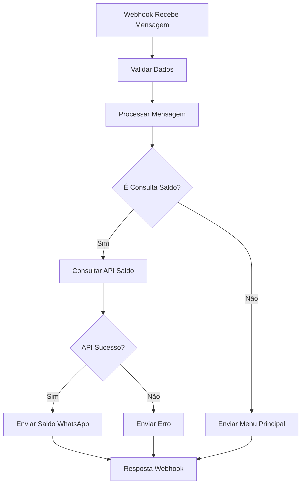

# Klube Cash - Workflow N8N para Consulta de Saldo

## 📋 Descrição

Este workflow N8N integra Evolution API com WhatsApp para consulta de saldo do Klube Cash. Funciona de forma similar ao bot WhatsApp existente, mas usando N8N para processamento das mensagens.

## 🚀 Como Importar no N8N

1. Acesse seu N8N: `https://n8n.klubecash.com`
2. Faça login com: `kaua@ticketsync.com.br` / `Sneha: Aaku_2004@`
3. Clique em "Import from file"
4. Selecione o arquivo: `n8n-workflow-consulta-saldo-definitivo.json`
5. Clique em "Import"

⚠️ **Use o arquivo DEFINITIVO**: `n8n-workflow-consulta-saldo-definitivo.json` que resolve TODOS os problemas de webhook e execução

## ⚙️ Configuração

### 1. Webhook URL
O workflow será acessível através da URL:
```
https://n8n.klubecash.com/webhook/consulta-saldo
```

### 2. Evolution API
As configurações da Evolution API já estão definidas no workflow:
- **URL**: `https://evolutionapi.klubecash.com`
- **Instância**: `KluebCash`
- **API Key**: `HONejkqQLlxZoeYiaQxmUczVRTdqscw2`

### 3. API de Saldo
O workflow usa a mesma API do projeto WhatsApp:
- **URL**: `https://klubecash.com/api/whatsapp-saldo.php`
- **Secret**: `klube-cash-2024`

## 🔗 Configurar Webhook na Evolution API

Para que o workflow receba as mensagens do WhatsApp, configure o webhook na Evolution API:

```bash
curl -X POST https://evolutionapi.klubecash.com/webhook/set/KluebCash \
  -H "Content-Type: application/json" \
  -H "apikey: HONejkqQLlxZoeYiaQxmUczVRTdqscw2" \
  -d '{
    "url": "https://n8n.klubecash.com/webhook/consulta-saldo",
    "enabled": true,
    "webhookByEvents": false,
    "webhookBase64": false,
    "events": [
      "MESSAGES_UPSERT"
    ]
  }'
```

## 📱 Como Funciona

### 1. Recepção de Mensagens
- O webhook recebe mensagens do WhatsApp via Evolution API
- Filtra apenas mensagens de texto (não de grupos)
- Extrai número do telefone e conteúdo da mensagem

### 2. Processamento
O workflow identifica mensagens de consulta de saldo através de:
- **Opção do menu**: "1"
- **Palavras-chave**: "saldo", "extrato", "consulta", "dinheiro", "valor", "quanto tenho"

### 3. Fluxo de Execução



## 💬 Mensagens de Exemplo

### Menu Principal
```
🏪 *Klube Cash* - Bem-vindo!

Digite o número da opção desejada:

1️⃣ Consultar Saldo

Ou envie uma mensagem com palavras como: saldo, extrato, consulta
```

### Consulta de Saldo (Sucesso)
A resposta vem da API `whatsapp-saldo.php` e pode incluir:
- Nome do usuário
- Saldo total
- Detalhes das carteiras
- Instruções adicionais

### Mensagem de Erro
```
❌ Erro ao consultar saldo. Tente novamente mais tarde.
```

## 🔧 Nodes do Workflow

1. **Webhook Receptor** - Recebe mensagens da Evolution API
2. **Validar Webhook** - Verifica se os dados estão completos
3. **Processar Mensagem** - Extrai informações e determina ação
4. **Verificar se é Consulta Saldo** - Identifica mensagens de saldo
5. **Consultar Saldo API** - Chama a API de saldo do Klube Cash
6. **Verificar Sucesso API** - Valida resposta da API
7. **Enviar Saldo WhatsApp** - Envia saldo via Evolution API
8. **Enviar Erro Saldo** - Envia mensagem de erro
9. **Enviar Menu Principal** - Envia menu para outras mensagens
10. **Resposta Webhook** - Confirma processamento

## 📊 Monitoramento

### Logs do N8N
- Acesse a aba "Executions" no N8N para ver todas as execuções
- Verifique erros e sucessos em tempo real
- Analise o fluxo de dados entre os nodes

### Teste Manual
1. Acesse o N8N
2. Abra o workflow "Klube Cash - Consulta Saldo WhatsApp via Evolution API"
3. Clique em "Execute Workflow" para teste manual
4. Use dados de exemplo no webhook

## 🛠️ Troubleshooting

### Problemas de Ativação e Execução do Workflow
- ✅ Use o arquivo **DEFINITIVO**: `n8n-workflow-consulta-saldo-definitivo.json`
- ✅ Resolve erro: "Wrong type: '' is a string but was expecting an object"
- ✅ Resolve problemas de configuração do Webhook
- ✅ Adiciona headers Content-Type nas respostas
- ✅ Webhook configurado corretamente para "responseNode"
- ✅ Verifique se todos os nodes estão conectados

### Webhook não recebe mensagens
- Verifique se o webhook está configurado na Evolution API
- Confirme se a URL está correta
- Verifique se a instância `KluebCash` está ativa

### API de Saldo não responde
- Verifique se `https://klubecash.com/api/whatsapp-saldo.php` está acessível
- Confirme se o secret `klube-cash-2024` está correto
- Verifique timeout da requisição (30 segundos)

### Evolution API não envia mensagem
- Verifique se a API Key está correta
- Confirme se a instância `KluebCash` está conectada
- Verifique formato do número de telefone

### Correções Aplicadas no Arquivo DEFINITIVO:
- ✅ **WEBHOOK CORRIGIDO**: Parâmetro "Respond" configurado para "Using Respond to Webhook Node"
- ✅ **HEADERS ADICIONADOS**: Content-Type nas respostas do webhook (text/plain; charset=utf-8)
- ✅ **NODES DE RESPOSTA SEPARADOS**: Respostas de sucesso e erro independentes
- ✅ **ERRO DE TIPO CORRIGIDO**: Mudança de `typeValidation: "strict"` para `"loose"`
- ✅ **CONDIÇÕES SIMPLIFICADAS**: Uso de operadores de string ao invés de boolean
- ✅ **VALIDAÇÃO ROBUSTA**: Melhor tratamento de dados vazios no webhook
- ✅ **CÓDIGO JAVASCRIPT APRIMORADO**: Logs para debug e diferentes formatos de mensagem
- ✅ Removidas configurações desnecessárias dos nodes
- ✅ Ajustadas configurações de HTTP Request

## 🔄 Diferenças do Bot WhatsApp Original

### Vantagens do N8N
- ✅ Interface visual para modificações
- ✅ Logs centralizados
- ✅ Fácil manutenção
- ✅ Integração nativa com múltiplas APIs
- ✅ Não requer servidor dedicado

### Funcionalidades Mantidas
- ✅ Consulta de saldo via palavras-chave
- ✅ Menu interativo com opção "1"
- ✅ Mesmo sistema de autenticação
- ✅ Mesma API de saldo
- ✅ Tratamento de erros

### Funcionalidades Removidas
- ❌ Cadastro de usuários (opção "2")
- ❌ Menu dinâmico por tipo de cliente
- ❌ Cache local de processo de cadastro
- ❌ Logs em arquivo local

## 📈 Próximos Passos

Para expandir o workflow, considere adicionar:
1. **Sistema de cadastro** - Implementar fluxo completo de registro
2. **Menu dinâmico** - Adaptar menu baseado no tipo de cliente
3. **Notificações** - Sistema de envio de alertas
4. **Analytics** - Métricas de uso e performance
5. **Fallback** - Sistema de backup em caso de falha

---

**Desenvolvido para Klube Cash** | **Versão 1.0** | **Setembro 2025**