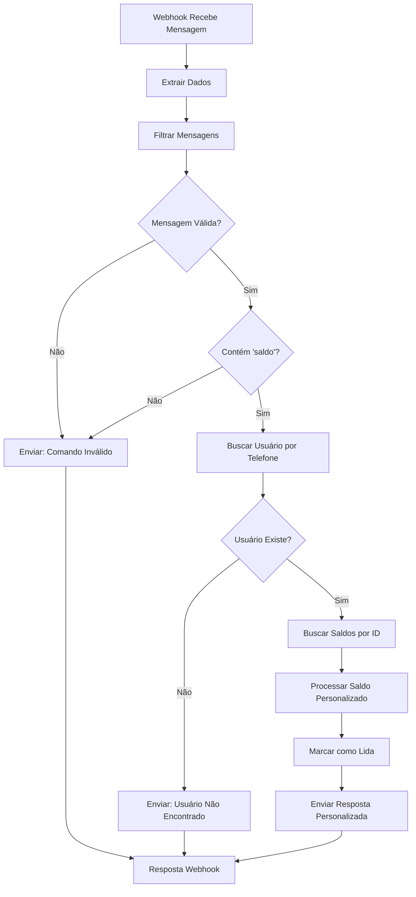

# Klube Cash - Workflow N8N Inteligente para Consulta de Saldo

## 📋 Descrição

Workflow N8N avançado baseado no sistema existente "Klubecash (1).json", adaptado para consulta de saldo através de **identificação por ID no banco de dados** com **mensagens completamente personalizadas**. Remove códigos desnecessários e usa apenas consultas diretas ao banco.

## 🎯 Principais Melhorias

### ✅ **Identificação por ID no Banco**
- Busca usuário por telefone na tabela `usuarios`
- Usa o `user_id` para consultar saldos na tabela `cashback_saldos`
- Método mais eficiente e seguro

### ✅ **Mensagens Personalizadas**
- Mensagens únicas para cada situação
- Saudação personalizada com nome do usuário
- Detalhamento por tipo de cashback
- Dicas inteligentes baseadas no saldo

### ✅ **Sem Códigos Desnecessários**
- Remove AI Agent e Gemini (consultas diretas ao banco)
- Remove Redis Memory (não necessário para consultas simples)
- Foco apenas na funcionalidade de saldo

## 🚀 Como Importar

1. Acesse: `https://n8n.klubecash.com`
2. Login: `kaua@ticketsync.com.br` / `Sneha: Aaku_2004@`
3. Import: `n8n-workflow-klube-saldo-inteligente.json`

## ⚙️ Configuração

### 1. Webhook URL
```
https://n8n.klubecash.com/webhook/saldo-inteligente
```

### 2. Banco de Dados
Usa as mesmas credenciais MySQL do workflow original:
- **Tabela usuários**: Busca por telefone
- **Tabela cashback_saldos**: Busca por user_id

### 3. WAHA API
Mantém as mesmas credenciais do workflow original para envio das mensagens.

## 🔄 Fluxo do Workflow



## 💬 Exemplos de Mensagens Personalizadas

### 👤 **Usuário com Saldo**
```
👋 Olá, João Silva!

💰 Seu Saldo Total: R$ 125,50

📊 Detalhamento:
Cashback Compras: R$ 85,30
Cashback Indicação: R$ 40,20

📅 Última atualização: 23/09/2025

🏪 Continue comprando nos estabelecimentos parceiros para acumular mais cashback!

💡 Dica: Você já pode solicitar o resgate do seu cashback!
```

### 👤 **Usuário sem Saldo**
```
👋 Olá, Maria Santos!

💰 Seu Saldo Atual: R$ 0,00

Você ainda não possui movimentações em sua conta.

🛍️ Faça suas compras nos estabelecimentos parceiros e comece a acumular cashback!
```

### ❌ **Usuário Não Cadastrado**
```
❌ Usuário não encontrado

Olá! Seu número 11987654321 não está cadastrado no sistema Klube Cash.

📞 Entre em contato conosco para fazer seu cadastro e começar a acumular cashback!
```

### 🚫 **Comando Inválido**
```
🚫 Comando não reconhecido

Para consultar seu saldo, envie uma das palavras:
• saldo
• extrato
• consulta
• quanto tenho

Ou digite 1 para o menu principal.
```

## 🛠️ Nodes do Workflow

1. **Webhook** - Recebe mensagens da WAHA API
2. **Extrair Dados** - Processa dados do webhook (telefone, nome, mensagem)
3. **Filtrar Mensagens** - Filtra apenas mensagens válidas (não próprias)
4. **Verificar Comando Saldo** - Detecta palavras-chave de consulta
5. **Buscar Usuário por Telefone** - Query MySQL na tabela `usuarios`
6. **Verificar se Usuário Existe** - Valida se encontrou usuário
7. **Buscar Saldos por ID** - Query MySQL na tabela `cashback_saldos`
8. **Processar Saldo Personalizado** - JavaScript para criar mensagem personalizada
9. **Marcar como Lida** - WAHA: marca mensagem como visualizada
10. **Enviar Resposta Personalizada** - WAHA: envia resposta customizada
11. **Enviar: Usuário Não Encontrado** - WAHA: mensagem para não cadastrados
12. **Enviar: Comando Inválido** - WAHA: mensagem para comandos inválidos
13. **Resposta Webhook** - Confirma processamento

## 🎨 Recursos Inteligentes

### 💡 **Dicas Automáticas**
- Saldo ≥ R$ 50,00: Sugere resgate
- Saldo = R$ 0,00: Incentiva primeiras compras
- Usuário não cadastrado: Direciona para cadastro

### 📊 **Detalhamento Inteligente**
- Agrupa saldos por tipo/carteira
- Mostra valores individuais
- Calcula total automaticamente

### 👋 **Personalização**
- Usa nome real do usuário
- Data de última atualização
- Mensagens contextuais

## 🔧 Configurar Webhook na WAHA

```bash
curl -X POST https://sua-waha-api.com/api/webhook \
  -H "Content-Type: application/json" \
  -d '{
    "url": "https://n8n.klubecash.com/webhook/saldo-inteligente",
    "events": ["message"],
    "enabled": true
  }'
```

## 📈 Vantagens do Workflow Inteligente

### ✅ **Eficiência**
- Consultas diretas ao banco (sem IA desnecessária)
- Identificação precisa por ID
- Processamento mais rápido

### ✅ **Personalização**
- Mensagens únicas para cada usuário
- Contexto baseado no saldo real
- Dicas inteligentes automáticas

### ✅ **Manutenibilidade**
- Código JavaScript claro e documentado
- Fluxo linear e simples
- Fácil adição de novos recursos

### ✅ **Confiabilidade**
- Identificação por ID (não por nome/telefone apenas)
- Tratamento de todos os cenários
- Validações em cada etapa

## 🔄 Diferenças do Workflow Original

### **Removido**
- ❌ AI Agent com Gemini
- ❌ Redis Chat Memory
- ❌ Ferramentas MySQL complexas
- ❌ Sistema de prompt/IA

### **Adicionado**
- ✅ Identificação por ID no banco
- ✅ Mensagens 100% personalizadas
- ✅ Detalhamento por tipo de saldo
- ✅ Dicas inteligentes automáticas
- ✅ Tratamento de erros específicos

### **Mantido**
- ✅ Credenciais MySQL existentes
- ✅ Credenciais WAHA existentes
- ✅ Estrutura de dados do webhook
- ✅ Funcionalidade de marcar como lida

## 📊 Estrutura do Banco

### Tabela `usuarios`
```sql
- id (PRIMARY KEY)
- nome
- telefone
- email
- ...
```

### Tabela `cashback_saldos`
```sql
- id (PRIMARY KEY)
- user_id (FK para usuarios.id)
- tipo
- valor
- ...
```

---

**Desenvolvido para Klube Cash** | **Versão Inteligente 1.0** | **Setembro 2025**